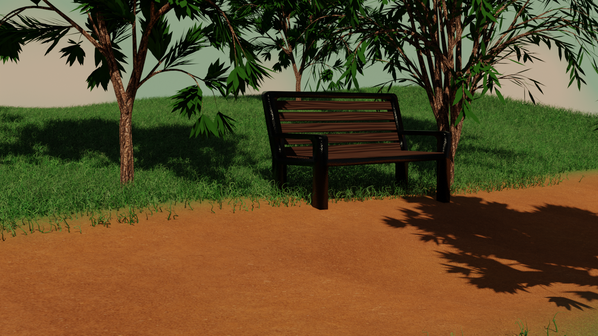

Bench in the park made in blender with blender cycles.

</img>

<b>Credits</b> 
https://www.google.com/search?client=firefox-b-d&sca_esv=570966760&sxsrf=AM9HkKm1cVp_iuYdGl6yxhGeCAikCTTc2g:1696511191660&q=grass+texture&tbm=isch&source=lnms&sa=X&ved=2ahUKEwi24r3X_N6BAxX7gv0HHTD6DZAQ0pQJegQIDBAB&biw=1920&bih=947&dpr=1#imgrc=gOLsvVcjsn2IAM

https://www.google.com/search?client=firefox-b-d&sca_esv=570966760&sxsrf=AM9HkKljjbzmEJBn_j_R-pKKutxuF6EFxw:1696512756824&q=dirt+texture&tbm=isch&source=lnms&sa=X&ved=2ahUKEwjNvOjBgt-BAxUByaQKHfZXBS0Q0pQJegQIChAB&biw=1920&bih=947&dpr=1#imgrc=ld3aT5eiW46CvM

https://www.google.com/search?q=tree+texture&tbm=isch&ved=2ahUKEwjdwYXL7-SBAxXvOhAIHaHsC0AQ2-cCegQIABAA&oq=tree+texture&gs_lcp=CgNpbWcQAzIFCAAQgAQyBwgAEIoFEEMyBQgAEIAEMgQIABAeMgQIABAeMgQIABAeMgQIABAeMgQIABAeMgQIABAeMgQIABAeOgQIIxAnOgcIIxDqAhAnUMcRWKhBYKVCaAJwAHgAgAGTAYgB1giSAQM5LjSYAQCgAQGqAQtnd3Mtd2l6LWltZ7ABCsABAQ&sclient=img&ei=aswhZd3kE-_1wPAPodmvgAQ&bih=947&biw=1920&client=firefox-b-d#imgrc=dylUvBQmtU-D_M
